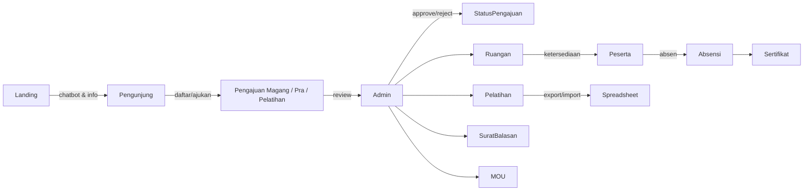

# Sindikat

Sistem Informasi Pelatihan dan Pendidikan, Penelitian Diklat untuk mengelola pengajuan magang/penelitian, pelatihan, ruangan, absensi, sertifikat, MOU, dan surat balasan dalam satu dashboard.

---

## Ringkasan
- Laravel 7 dengan modul lengkap untuk peserta dan admin (approval pengajuan, penjadwalan ruangan, ekspor dokumen).
- Chatbot landing berbasis intent sederhana yang memberi ringkasan data real-time (mahasiswa, pengajuan, pelatihan, ruangan, mitra, absensi).
- Import/ekspor spreadsheet, cetak PDF (sertifikat, surat balasan), serta tautan publik untuk update data pelatihan.
- Multi-peran: admin dan peserta (magang, pra-penelitian, pelatihan) dengan middleware khusus.

---

## Fitur Utama
- **Pengajuan & Approval**: magang, pra-penelitian, dan pelatihan dengan status waiting/approve/reject serta upload bukti pembayaran.
- **Dashboard & Chatbot**: ringkasan metrik mahasiswa, pengajuan, pelatihan, ruangan, mitra, dan absensi harian.
- **Pelatihan & Peserta**: impor/ekspor data, edit via tautan publik, rekap peserta, dan sertifikat unduh berbasis token.
- **Ruangan & Penempatan**: manajemen ruangan, kapasitas/ketersediaan (tersedia/penuh), dan jadwal penempatan.
- **Absensi & Sertifikat**: kartu absensi token, toggle kehadiran, unduhan sertifikat publik/admin.
- **Dokumen Resmi**: surat balasan (PDF), manajemen MOU/mitra (import Excel), dan catatan internal admin.
- **Konsultasi & Komunikasi**: modul konsultasi (CRUD) untuk peserta yang sudah mendapat CI/izin admin.
- **User Management**: approval akun, hapus user, dan pengaturan role via dashboard admin.

---

## Arsitektur Singkat


---

## Teknologi
- Laravel 7, PHP >= 7.2.5, Composer.
- NPM + Laravel Mix untuk aset frontend.
- Database: MySQL/MariaDB (konfigurasi di `.env`).
- PDF generator: `barryvdh/laravel-dompdf`.

---

## Persyaratan
- PHP 7.2.5+ dan Composer.
- Node.js + NPM.
- MySQL/MariaDB terpasang dan dapat diakses.

---

## Instalasi Cepat
1. Clone repositori dan masuk ke folder proyek.
   ```bash
   git clone <repo-url> sindikat
   cd sindikat
   ```
2. Pasang dependensi backend & frontend.
   ```bash
   composer install
   npm install
   npm run dev
   ```
3. Salin konfigurasi lingkungan dan sesuaikan.
   ```bash
   cp .env.example .env
   # set DB_DATABASE, DB_USERNAME, DB_PASSWORD, APP_URL
   php artisan key:generate
   ```
4. Migrasi dan seed data awal (termasuk user admin).
   ```bash
   php artisan migrate --seed
   ```
5. Jalankan server lokal.
   ```bash
   php artisan serve
   # akses http://localhost:8000
   ```

### Akun Default (Seeder)
- Admin: `admin@gmail.com` / `password`
- User: `user@gmail.com` / `password`

---

## Modul & Alur Kerja
- **Landing & Chatbot**: ringkasan data dan jawaban intent (status pengajuan, ruangan, absensi, mitra, dsb).
- **Pengajuan**: peserta ajukan magang/pra-penelitian/pelatihan, unggah bukti, pantau status; admin approve/reject/kirim galasan.
- **Pelatihan**: create/edit/export/import, tautan publik untuk koreksi data peserta, rekap peserta.
- **Mahasiswa/Peserta**: dashboard khusus, pencarian universitas, edit profil diri, ekspor data, sertifikat per peserta.
- **Ruangan & Ketersediaan**: daftar ruangan, kapasitas, status (tersedia/penuh) untuk penempatan.
- **Pra-Penelitian**: CRUD data, approve/reject form, batalkan pengajuan.
- **Absensi & Sertifikat**: kartu absensi berbasis token, toggle kehadiran, unduhan sertifikat publik/admin.
- **Dokumen Resmi**: surat balasan (PDF), MOU/mitra (import Excel), catatan internal admin.
- **User & Keamanan**: login/register, approval akun oleh admin, role-based middleware (admin, magang, pra).

---

## Perintah Pengembangan Berguna
- `php artisan migrate:fresh --seed` — reset database saat pengembangan.
- `npm run dev` / `npm run prod` — kompilasi aset.
- `phpunit` — menjalankan test bawaan Laravel.

---

## Lisensi
Proyek dilisensikan di bawah lisensi [MIT](LICENSE). Silakan gunakan, modifikasi, dan distribusikan sesuai kebutuhan.
